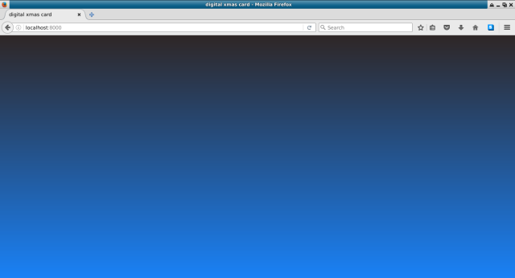
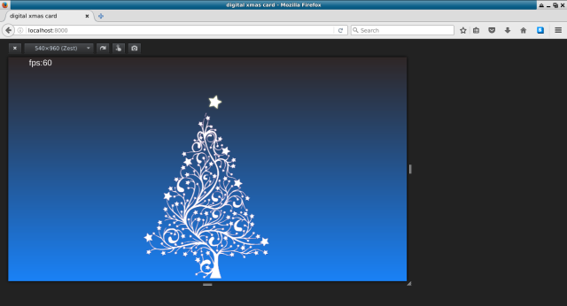
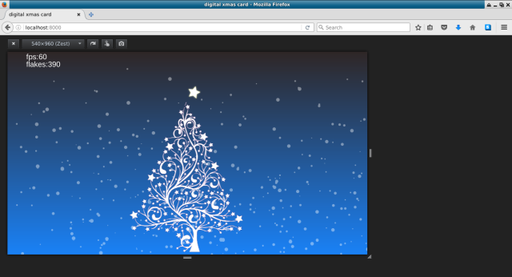
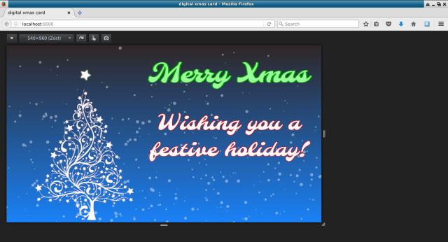

# Snowflakes

I will now walk you through creating a digital xmas card for the festive season. We will use vanilla JavaScript and the web canvas API. There will be drifting snowflakes, a tree and some merry words.

See the [live demo here](https://wesleywerner.github.io/snowflakes/).

To scope out our goals:

* Draw an image of a tree
* Draw a rotating star above the tree
* Animate falling snowflakes
* Display a festive message

Let's get to it!

### Add empty page, background gradient and blank `js` file ([commit](https://github.com/wesleywerner/snowflakes/commit/2eb0252c0ed660c4ae194b58e3dd30fad55e55b1))

We start with a minimal HTML, CSS and JS scaffold. The most prominent feature here is the background gradient in the style sheet, giving our page a picturesque skyline.

### Include images in the page, write a basic pre-loader ([commit](https://github.com/wesleywerner/snowflakes/commit/fee114cf5b486ede77c039c068db8dfc3315f0b7))

Diving right into the JavaScript, we need a pre-loader for our images. We place image tags inside an invisible `div` and give them named data attributes to grab them easier using query selectors. We shove a canvas tag in here while we are at it.

**HTML**

    <body>
      <canvas></canvas>
      

        
        
      

      
    </body>

**JS**

    /*
     * wrapped in a closure so we don't create global variable pollution.
     */
    var xmas = ( function() {
      
      /*
       * Our data object houses preloaded images, snowflake data and
       * anything else we want to persist.
       */
      var data = {
        loaded: false,
        images: {}
      }
      
      
      /*
       * A basic preloader that looks for predefined images, and loads
       * them as images become available.
       * Once all are loaded, set the 'loaded' property true.
       */
      function loadResources() {
        data.images.tree = document.querySelector('img[data-name="tree"]');
        data.images.star = document.querySelector('img[data-name="star"]');
        data.loaded = (data.images.tree != null && data.images.star != null);
        // retry if not yet loaded
        if (!data.loaded) setTimeout(loadResources, 500);
      }

      // start resource loading
      loadResources();
      
      // return our data store to the main window scope
      return data;
      
    })();

This creates the only global object, named `xmas`. The images will be available as `xmas.images.tree` and `xmas.images.star`.

### Setup the canvas context ([commit](https://github.com/wesleywerner/snowflakes/commit/15b4b9422cf3905d01837559b0eb5b6ccb3545f7))

Next we grab the canvas element and create the 2d context, we store both of these on the xmas object:

**JS**

    var data = {
      loaded: false,
      canvas: null,
      context: null,
      images: {}
    }
    
    function setupCanvas() {
      data.canvas = document.querySelector('canvas');
      if (data.canvas == null) throw ('No canvas element found on the page.');
      data.context = data.canvas.getContext('2d');
    }

### Add a frame per second calculator ([commit](https://github.com/wesleywerner/snowflakes/commit/8e0be6b6cdf758b49b3db1044dab92fcc29b971c))

Planning ahead, we add a frames-per-second calculator. We will cleverly add or remove snowflakes to accommodate a modest frame rate, so that faster devices will show more snow, while slower devices will show less snow to prevent them from choking. Later we will add to this to ensure animations display at a constant speed across varying frame rates. We add a main drawing loop and print the FPS:

**JS**

    /*
     * A simple frames per second calculator.
     */
    data.fps = {
      current: 0,
      startTime: 0,	
      frameNumber: 0,	
      getFPS: function(){		
        this.frameNumber++;		
        var d = new Date().getTime();
        var currentTime = ( d - this.startTime ) / 1000;
        this.current = Math.floor( ( this.frameNumber / currentTime ) );
        if( currentTime > 1 ){
          this.startTime = new Date().getTime();
          this.frameNumber = 0;
        }
      }
    };
    
    
    /*
     * Main drawing loop.
     */
    function draw() {

      requestAnimationFrame(draw);
      
      if (!data.loaded) return;
      
      // clear the screen
      data.context.clearRect(0, 0, 200, 30);
      
      // calculate rendering speed
      data.fps.getFPS();
      
      // print debug information
      data.context.font = '20px arial';
      data.context.fillStyle = '#fff';
      data.context.fillText('fps:' + data.fps.current, 50, 20);
    }

    // start resource loading and canvas setup
    loadResources();
    setupCanvas();
    draw();

### Add a periodic check to auto adjust the canvas size to fill the window  ([commit](https://github.com/wesleywerner/snowflakes/commit/da7da0a08bf591b796f3ba3c156df845f4c3b03f))

To adapt our canvas to changing screen dimensions (rotating mobile devices and resized browser windows) we do a periodic check of the window size against the current known size. If a difference is detected we adjust the canvas element size to match the screen. The known size starts at zero so this check evaluates for the first time after page load.

**JS**

    /*
     * Check for window size change and recalculate positions.
     */
    function resizeCheck() {
      // only when the known size differs from the actual
      if (data.W != window.innerWidth || data.H != window.innerHeight) {
        data.W = window.innerWidth;
        data.H = window.innerHeight;
        // apply the size to the canvas
        data.canvas.width = data.W;
        data.canvas.height = data.H;
      }
    }
    // perform this check periodically
    setInterval(resizeCheck, 1000);

### Calculate our tree and star positions, and draw them on screen  ([commit](https://github.com/wesleywerner/snowflakes/commit/9fcc081f7b395197538e257d45296b60bec26f92))

During the canvas size check we calculate the positions to draw our tree and star images:

   
**JS**

    function resizeCheck() {
      ...
      
      // recalculate image positions
      if (data.loaded) {
        // place the tree at the bottom-center
        var tree = data.images.tree;
        tree.pos = {
          x: data.W / 2 - tree.width / 2,
          y: data.H - tree.height
        }
        // place the star above the tree
        var star = data.images.star;
        star.pos = {
          x: tree.pos.x + tree.width / 2,
          y: tree.pos.y
        }
      }

And update our render loop to draw these images to the canvas context:
   
**JS**

    function draw() {
      ...
      
      // clear the screen
      data.context.clearRect(0, 0, data.W, data.H);
      
      // draw our tree
      data.context.drawImage(
        data.images.tree,
        data.images.tree.pos.x,
        data.images.tree.pos.y);
      
      // draw our star
      data.context.drawImage(
        data.images.star,
        data.images.star.pos.x,
        data.images.star.pos.y);

### Create a snowflake generator ([commit](https://github.com/wesleywerner/snowflakes/commit/faaf4940f667dfbc48aede6bb382f5164a8ed5d7))

The snowflake generator adds and removes flakes dependant on the FPS of your device. First we create a snowflake array to store all of them, and start with a minimal number of twenty flakes.

**JS**

    var data = {
      ...
      
      maxFlakes: 20,
      snowflakes: []
    }

Next we make the reusable function `makeFlake`:

**JS**

    /*
     * Create a unique snowflake.
     */
    function makeFlake () {
        return {
          x: Math.random() * data.W,
          y: Math.random() * data.H,
          r: Math.random() * 4 + 1,           // draw radius
          d: Math.random() * data.maxFlakes   // density (adjusts behaviour)
        }
    }

The `adjustFlakes` function checks the current frames per second and adds or removes flakes as required. We call this function periodically through an interval timer:

**JS**

    /*
     * Increase and decrease the number of snowflakes as allowed by fps.
     */
    function adjustFlakes() {
      // reduce snowflakes while fps is low
      if (data.fps.current < 10) {
        // clamp to a minimum number
        data.maxFlakes = Math.max(10, data.maxFlakes - 10);
      }
      else if (data.fps.current > 30) {
        // clamp to a maximum number
        data.maxFlakes = Math.min(500, data.maxFlakes + 10);
      }
      // cull any extra flakes
      if (data.snowflakes.length > data.maxFlakes) {
        data.snowflakes.splice(data.maxFlakes, data.snowflakes.length - data.maxFlakes);
      }
      // add any missing flakes
      while (data.snowflakes.length < data.maxFlakes) {
        data.snowflakes.push(makeFlake());
      }
    }
    setInterval(adjustFlakes, 1000);

### Update and render flakes  ([commit](https://github.com/wesleywerner/snowflakes/commit/5e8b99885e4a610f9471732d1786e7b45a02c05c))

An incremental angle is used to work out flake movement. Since this one variable affects all snowflakes they will appear to move in synchronicity.

**JS**

    var data = {
      ...
      
      flakeAngle: 0,
    }

To ensure consistent speeds across devices, we update our FPS calculation to record the time passed since the last update, the delta time:

**JS**

    /*
     * A simple frames per second calculator.
     */
    data.fps = {
      ...
      
      delta: 0,
      lastTime: 0,
      getFPS: function() {
        ...
        
        var now = new Date().getTime();
        // track the difference in milliseconds since the last update
        this.delta = (now - this.lastTime) / 1000;
        this.lastTime = now;
      }
    };

The fun part starts with animating the snowflake movements:

**JS**

    /*
     * Update and draw snowflakes.
     */
    function renderSnowflakes(dt) {

      data.context.fillStyle = "rgba(255, 255, 255, 0.4)";
      data.context.beginPath();
      
      // the angle, pushed through sin and cos functions, oscillates
      // the flake movement.
      data.flakeAngle += 0.01;
      
      for (var i=0; i<data.snowflakes.length; i++) {
      
        var p = data.snowflakes[i];
        
        // the vertical cosine movement gives the appearance of up-drafts
        var y = Math.cos(data.flakeAngle);
        
        // clamp to positive values so our flakes don't go up
        y = Math.max (0.5, y);
        
        // larger flakes fall quicker, giving a nice parallax effect
        y += (p.r * 0.1);
        
        // the horizontal sine movement gives the appearance of a breeze
        var x = Math.sin(data.flakeAngle) * 0.5;
        
        // larger flakes get the horizontal speed bonus too
        x += (p.r * 0.1);
        
        // finally, update the flake position at a delta ratio so it looks
        // consistent across varying framerates, with a speed factor.
        p.x += x * dt * 50;
        p.y += y * dt * 50;
        
        // add the flake arc to the drawing path
        data.context.moveTo(p.x, p.y);
        data.context.arc(p.x, p.y, p.r, 0, Math.PI*2, true);
        
        // warp flakes lost to the bottom of the window, back to the top
        if(p.y > data.H) {
          data.snowflakes[i] = makeFlake();
        }

      }
      
      data.context.fill();
      
    }

Call the snowflake renderer in the main animation loop:

**JS**

    function draw() {
      ...
      
      // draw our snow
      renderSnowflakes(data.fps.delta);
    }

### Rotate the star ([commit](https://github.com/wesleywerner/snowflakes/commit/f7806ca473f5f807943d4ebd437c8b8578870163))

Rotate the star above the tree, we calculate the centre of the star image on pre-load for later:

**JS**

    function resizeCheck() {
        ...
        
        star.cenX = star.width/2;
        star.cenY = star.height/2;
      }

Update and draw the star in the main animation loop:

    function draw() {
      ...
      
      // draw our rotating star
      var star = data.images.star;
      star.angle = (star.angle || 0) + 0.01;
      data.context.save();
      data.context.translate(data.images.star.pos.x, data.images.star.pos.y);
      data.context.rotate(data.images.star.angle);
      data.context.drawImage(data.images.star, -star.cenX, -star.cenY);
      data.context.restore();

### Show some festive words ([commit](https://github.com/wesleywerner/snowflakes/commit/87b791ffd4c475b08af41f3c11ac03007949a729))

Add some happy words in a floating container, and style the text:

**HTML**

    <body>
      

        
Merry Xmas

        
Wishing you a festive holiday!

      

      <canvas></canvas>

**CSS**

    #container {
      position: absolute;
      margin-left: auto;
      margin-right: auto;
      right: 40px;
      top: 40px;
    }

    #merrymessage {
      /* style the message font and color */
    }

    #usermessage {
      /* style the message font and color */
    }

### The End

There you have it, a digital xmas card. I added some extra embellishments on top of what is shown here, notably a music player and flashing sparkles that sync to the music, and on-screen buttons to toggle the music and full-screen modes.

Another feature loads a custom user message from the URL as base64 encoded text, as seen here [from html5gamedevs](https://wesleywerner.github.io/snowflakes/#RnJvbSBodG1sNWdhbWVkZXZzIQ==).

Please fork and have fun making your own xmas cards!

# Credits

* [Snowflakes digital xmas card by Wesley Werner](https://github.com/wesleywerner/snowflakes)
* [Christmas Tree image by Karen Arnold, Public Domain](http://www.publicdomainpictures.net/view-image.php?image=197531&picture=christmas-tree-modern-card)
* [JavaScript module player library by DhrBaksteen](https://github.com/DhrBaksteen/ScripTracker)
* [snowflake music by nutcase](http://modarchive.org/index.php?request=view_by_moduleid&query=169703)
* [material icons by Google](https://material.io/icons/)

# License

This program is free software: you can redistribute it and/or modify
it under the terms of the GNU General Public License as published by
the Free Software Foundation, either version 3 of the License, or
any later version.

This program is distributed in the hope that it will be useful,
but WITHOUT ANY WARRANTY; without even the implied warranty of
MERCHANTABILITY or FITNESS FOR A PARTICULAR PURPOSE.  See the
GNU General Public License for more details.

You should have received a copy of the GNU General Public License
along with this program. If not, see http://www.gnu.org/licenses/.

